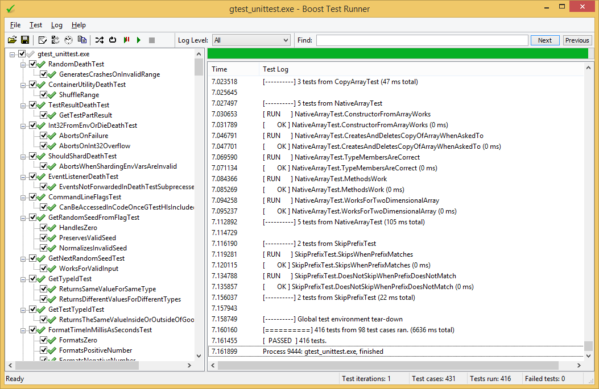

BoostTestUi (needs a better name because it supports multiple frameworks now)
-----------

[Download the latest release here](https://github.com/janwilmans/BoostTestUi/releases)

BoostTestUi provides a Windows gui runner for these test frameworks:

- [boost.test](http://www.boost.org/doc/libs/1_64_0/libs/test/doc/html/index.html)
- [google test](https://github.com/google/googletest) 
- [catch](https://github.com/philsquared/Catch)
- [nunit](https://nunit.org/)

Screenshot
-----------

How to build
------------

This is a Visual Studio 2017 project with the following dependencies:
- boost 1.67 or later
- WTL 9.0 or later
- Wix 3.11.x (for the installer)

only required for the GTestSample sample unit tests:
- gtest 1.6.0 or later
- Catch 1.10 (final catch v1 release)
- Nunit 2.6.7 or later
 
These dependencies are automatically retreived using Nuget during solution build.

Boost.test support
------------------

In your unit test, replace <boost/test/unit_test.hpp> with
<boost/test/unit_test_gui.hpp>:

	#define BOOST_TEST_MODULE Exe TestRunner Test
	#include <boost/test/unit_test_gui.hpp>

	BOOST_AUTO_TEST_CASE(MyTest) { ... }

You can also provide your own init_unit_test_suite() initialization function
by omitting BOOST_TEST_MODULE, as usual.

Google test support
-------------------

In your unit test, replace #include <gtest/gtest.h> with <gtest/gtest-gui.h>:

	#include <gtest/gtest-gui.h>

	TEST(MyTest, MyTestCase) { ... }

Then add InitGoogleTestGui() to your main function body like this:

	int main(int argc, char* argv[])
	{
		testing::InitGoogleTest(&argc, argv);
		testing::InitGoogleTestGui(&argc, argv);
		return RUN_ALL_TESTS();
	}

BoostTestUi
-----------

Run BoostTestUi.exe and open a unit test executable that was build with
the gui header included. The appropriate header can be generated from the
File -> Create Header menu. Store it preferably in a sub folder named
"boost/test" or "gtest" in one of your include directories. Now select
Run from the toolbar or the test tree context menu to run the tests.

Gert-Jan de Vos
mailto:boosttestui@on.nl

